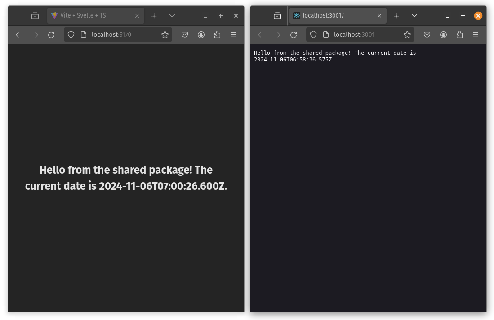

*There are as many ways to structure a monorepo as there are developers. This is a simple example to encourage you to keep your code together (when possible). Don't be afraid of modifying the structure to whatever works best for your case.*

# A simple Yarn monorepo example

In this repo I want to show we don't need anything fancy to keep our packages and apps together, this is a simple example on how we can use Yarn workspaces to manage a very flexible monorepo without extra dependencies.

This allows us to deploy our apps by simply pushing the entire monorepo to our CI/CD pipeline and let the provider decide which app to build/start according to an environment variable (which needs to be set for each app).

**This example shows:**
- a package shared across multiple apps
- a Svelte dashboard app which can be deployed to Vercel/Netlify/etc.
- a Hello World TypeScript server app that can be deployed to Dokku/Heroku/Google Cloud/etc.

# Quick local run
```
git clone git@github.com:cristianszwarc/simple-yarn-monorepo-example.git
cd simple-yarn-monorepo-example
yarn install
yarn dev
```

http://localhost:3001 will show a hello world message from the api app.

http://localhost:5170 will show the dashboard app.

Both urls should show a message from the shared package.



## Why Svelte?
Is only as an example, this structure works with React, Vue, Angular, React Native, etc. Just replace the Svelte apps with your preferred framework.
Same for the API, you can use Express, Fastify, Koa, etc.

## How this works
Yarn workspaces allows us to manage multiple packages and apps in a single repository. Each app can have their own dependencies and scripts, and it allows us to import shared code between them. 

The root `package.json` contains a `dev` script that runs all the `dev:` scripts in the `package.json` files of each app. This allows us to run all the apps locally with a single command.

The root `package.json` also contains a `build` and a `start` script that are calling `./scripts/build.js` and `./scripts/start.js` respectively. These scripts are responsible for building and starting the app according to the `WORKSPACE` environment variable.

*Feel free to experiment without the `./scrips` as middle-man, for example set the `build` command just as `yarn workspace $WORKSPACE build` or expand the `./scripts` to achieve more elaborated pipelines (maybe your apps/api is not a js app).*

## Structure
Yarn workspaces allow the structure to be super simple, there is a root `packages.json` that glues things together and there is an `apps` folder that contains all the packages and apps we want to manage.

You can name this `apps` folder whatever you want, if you rename it make sure you adapt the `workspaces` property at the root `package.json` accordingly.
```
├── apps
|   ├── api
│   ├── dashboard
│   └── sharedPackage1
├── package.json
└── yarn.lock
```

## Production environment
- Set a `WORKSPACE` environment variable to specify which app you want to build/start.
- Set the build command (if you have a build step) `yarn build`.
- Set the start/run command (if you need to start a server) `yarn start`.

### Static apps example
In Vercel/Netlify/etc., add an environment variable of `WORKSPACE` with the name of the app you want to build for example `dashboard`. Then set your deployment settings to something like:
```
Base directory: /
Build command: yarn build
Publish directory: apps/dashboard/build
```

### Server apps example
In Dokku/Heroku/Google Cloud/etc., create a new app e.g. `my_api` and set an environment variable of `WORKSPACE` with the name of the app you want to build/start for e.g. `api`. 
Then set your deployment settings set the root directory and `yarn build` / `yarn start` commands (if needed).

In Dokku (heroku-buildpack-nodejs) you just need to set the `WORKSPACE` environment variable, because the build/start process will be automatically detected:
```
dokku config:set my_api \
     WORKSPACE=api \
     NODE_ENV=production \
     NODE_SECRET=SOME_SECRET
``` 

## Development environment
### Add a new app

- Create a new folder in the `apps` directory.
- cd into the new dir and run `yarn init -y` to create a new empty app or package.
- cd back into the root of the monorepo and run `yarn install` to install the new app/package requirements.
- add a `dev:my_new_app` script in the root `package.json` to get the app running locally alongside the other apps.
- you may want to check your app config to set a custom port and avoid conflicts with other apps of the monorepo. 

> Alternatively, you can copy an existing app that you may already have created by `npm create vite@latest`, in this case don't copy the `node_modules` folder and remove the `packages.lock` file. Just make sure to always run `yarn install` in the root after copying an app/package.

Example:
```
mkdir apps/my_new_app
cd apps/my_new_app
yarn init -y
cd ../..
yarn install
```

### Run entire monorepo locally
Executing `yarn dev` will run all scripts with the `dev:` prefix in the root `package.json` file.
You must have one `dev:my_app` script for each app/package you want to run locally.

### Run a single app locally (or specific app scripts)
You can run a single app by executing `yarn dev:my_app` where `my_app` is the name of the app/package you want to run.
Or you can execute app scripts directly by running `yarn workspace @my_app/my_app script_name`.

Example:
```
yarn dev:api
yarn workspace api inspect
```

### Add an external package to an app
External packages are meant to be added into each app and not the root `package.json` file.
```
cd apps/my_app
yarn add my_package
cd ../..
```

## Shared packages

Shared packages can be accessed by all apps in the monorepo without needing to publish them to a package registry and without needing to list them in the `dependencies` of each app.
Make sure you name the package in the `package.json` file with the `@` symbol followed by the name of the package, this will allow you to import the package in your apps without needing to specify the path. for example:
```json
{
  "name": "@shared/package1"
}
``` 
Then to use the shared package in an app:
```javascript
import { myFunction } from '@shared/package1';
```

## Debugging Shared packages
When you run your app with `inspect` enabled, there are two main considetations:
- the breakpoints will be hit only in your app code and not in the shared package code (solution bellow).
- you may want to set different inspect ports for each app to avoid conflicts if you want to run multiple inspect sessions at the same time.

To allow breakpoints in the shared package code, configure your debugger with `outFiles` (vscode) pointing to the shared package source files.
In WebStorm this is achieved in the debug configuration by adding the shared package directory in `Remote URLs of local files`.

## File changes
Depending on the way you set a `watch` option for each app (ts watch / nodemon, etc.), It may or not detect changes made to the shared package. 

An app created with Vite/Svelte will reload after changes are made to the shared package without any extra configuration.

On the other side if you are using `nodemon` in your app dev script, you need to add an extra `--watch` for each shared package you want to react to changes.

Example:
```
nodemon --watch src --watch ../shared-package-1 --exec ts-node src/index.ts
```

## Security considerations
Make sure your CI/CD process is correctly configured to only publish/run the build folder of the app you want to deploy and not the entire monorepo.

For example in Vercel/Netlify/etc. you need set the `publish` directory to `apps/dashboard/build`.
